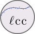

<!-- README.md is generated from README.Rmd. Please edit that file -->
lcc 
================================================================

[](https://img.shields.io/badge/development-active-blue.svg) [](https://cran.r-project.org/package=lcc) [](https://travis-ci.org/Prof-ThiagoOliveira/lcc) [](https://codecov.io/github/Prof-ThiagoOliveira/lcc?branch=master) [](https://ci.appveyor.com/project/Prof-ThiagoOliveira/lcc)

`lcc` is a package under development based on estimation procedures for longitudinal concordance correlation (lcc), longitudinal Pearson correlation (lpc), and longitudinal accuracy (la) through fixed effects and variance components of polynomial mixed-effect regression model. The main features of the package are its ability to perform inference about the extent of agreement and use a numerical and graphical to summary the fitted values, sampled values, and confidence intervals. Morever, our approach accommodate balanced or unbalanced experimental design, allows to model heteroscedasticity among within-group errors using or not the time as covariate, and also allows for inclusion of covariates in the linear predictor to control systematic variations in the response variable. It was developed by Thiago de Paula Oliveira \[cre, aut\], Rafael de Andrade Moral \[aut\], John Hinde \[aut\], Silvio Sandoval Zocchi \[aut,ctb\], Clarice Garcia Borges Demétrio \[aut,ctb\].

It has been available on CRAN since 2018 (<https://cran.r-project.org/package=lcc>). Its last version was updated on 2019-02-13. CRAN has lcc's stable version, which is recommended for most users.

This github page has its version under development. New functions will be added as experimental work and, once it is done and running correctly, we will synchronize the repositories and add it to the CRAN.

We worked hard to release a new stable version allowing users to analyze data sets, where the objective is studied the extent of the agreement profile among methods considering time as covariable.

`lcc` comprises a set of functions that allows users build and summaries the fitted model, estimates and bootstrap confidence intervals for lcc, lpc and la statistics, and build graphical summaries for them. Some functions are used internally by the package, and should not be used directly.

Installation
============

Installed from CRAN:
--------------------

``` r
install.packages("lcc")
```

Installed the development version from Github:
----------------------------------------------

``` r
install.packages("devtools")
devtools::install_github("Prof-ThiagoOliveira/lcc")
```

If you use Windows, first install [Rtools](https://cran.r-project.org/bin/windows/Rtools/). If you are facing problems with Rtools installation, try to do it by selecting *Run as Admnistrator* option with right mouse button. On a Mac, you will need Xcode (available on the App Store).

`lcc` can also be installed by downloading the appropriate files directly at the CRAN web site and following the instructions given in the section `6.3 Installing Packages` of the [R Installation and Administration](http://cran.r-project.org/doc/manuals/R-admin.pdf) manual.

Tutorials
=========

Under construction!! =D
